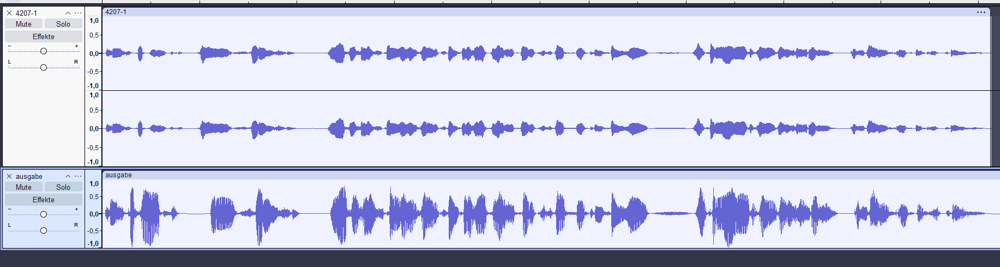

# text2torkel

## Frontend
 A very simple react TypeScript web interface 
 with some tips for cleaner english output of the sound output
 and link to the mastodon bot.

## Backend
 A very fast hacked together python flask http backend for the piperTTS voice model

### Model integration
 you can download the piper tts model "kantodel" used in this app at: [nullnullvier/kantodel ](https://huggingface.co/nullnullvier/kantodel)
 and place it in /api/data/models/, or use your own.

### nginx as revers proxy
 a nginx as revers proxy to run the flask endpoints in a non sudo venv environment. Run by Docker

# Creating an own model
 follow the steps in this tutorial: [piper model training ](https://github.com/rhasspy/piper/blob/master/TRAINING.md)

The generated voice is on the button, and the original sample is on top.

